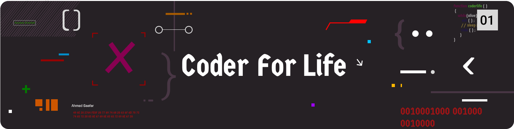

### 🚀 **BIENVENIDO A MI MUNDO DIGITAL!** 🌟🔥💻

  

<h1 align="center">
   ¡Hola! Soy Carlos Marrugo / @carlosdev ✨🔥
</h1>

  

<h3 align="left">Software Developer</h3>

<h3 align="left">Desarrollador Fullstack especializado en Backend con Spring Boot y Frontend con Angular</h3>

  
  

- 💼 &nbsp; **Estudiando Ingenieria de Software**  
- 🌱 &nbsp; Estoy aprendiendo más sobre **Arquitectura de Microservicios**  
- 💬 &nbsp; Me gusta hablar sobre **Java, Spring Boot, Angular y tecnologías web**  
- 📫 &nbsp; Contáctame en **[LinkedIn]([https://www.linkedin.com/in/tu-perfil/](https://www.linkedin.com/in/carlos-marrugo-701261283/))**  

## 🔥 **Tecnologías y herramientas** 🚀💻

**Languages and Tools:** 

&nbsp;&nbsp;
&nbsp;&nbsp;
&nbsp;&nbsp;
&nbsp;&nbsp;
&nbsp;&nbsp;
&nbsp;&nbsp;
&nbsp;&nbsp;
&nbsp;&nbsp;
&nbsp;&nbsp;
&nbsp;&nbsp;
&nbsp;&nbsp;
&nbsp;&nbsp;
&nbsp;&nbsp;
&nbsp;&nbsp;
&nbsp;&nbsp;
&nbsp;&nbsp;
&nbsp;&nbsp;
&nbsp;&nbsp;
&nbsp;&nbsp;
&nbsp;&nbsp;
&nbsp;&nbsp;
&nbsp;&nbsp;
&nbsp;&nbsp;
&nbsp;&nbsp;
&nbsp;&nbsp;
&nbsp;&nbsp;
&nbsp;&nbsp;
&nbsp;&nbsp;

**Mi Stack Favorito**
<table>
  <tr>
    <td align="center" width="96">
      
       Java
    </td>
    <td align="center" width="96">
      
       Spring Boot
    </td>
    <td align="center" width="96">
      
       Angular
    </td>
    <td align="center" width="96">
      
       TypeScript
    </td>
    <td align="center" width="96">
      
       PostgreSQL
    </td>
    <td align="center" width="96">
      
       Docker
    </td>
    <td align="center" width="96">
      
       Kubernetes
    </td>
    <td align="center" width="96">
      
       Git
    </td>
  </tr>
  <tr>
    <td align="center" width="96">
      
       Apache
    </td>
    <td align="center" width="96">
      
       Redis
    </td>
    <td align="center" width="96">
      
       MongoDB
    </td>
    <td align="center" width="96">
      
       AWS
    </td>
    <td align="center" width="96">
      
       Jira
    </td>
    <td align="center" width="96">
      
       VS Code
    </td>
    <td align="center" width="96">
      
       Jenkins
    </td>
    <td align="center" width="96">
      
       Figma
    </td>
  </tr>
</table>
