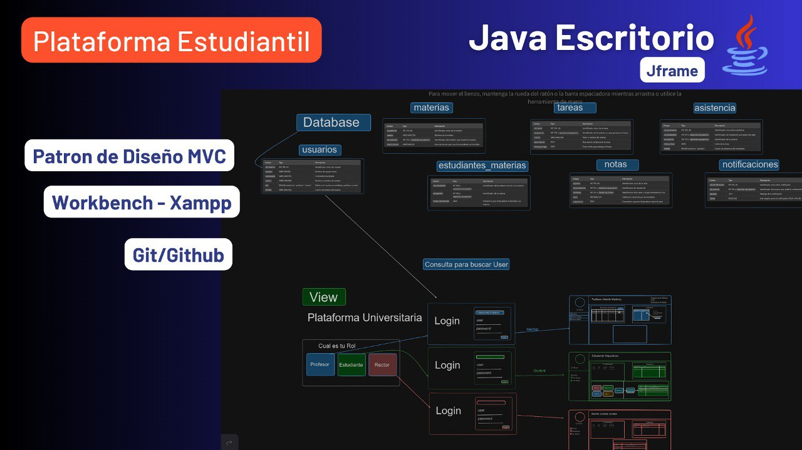
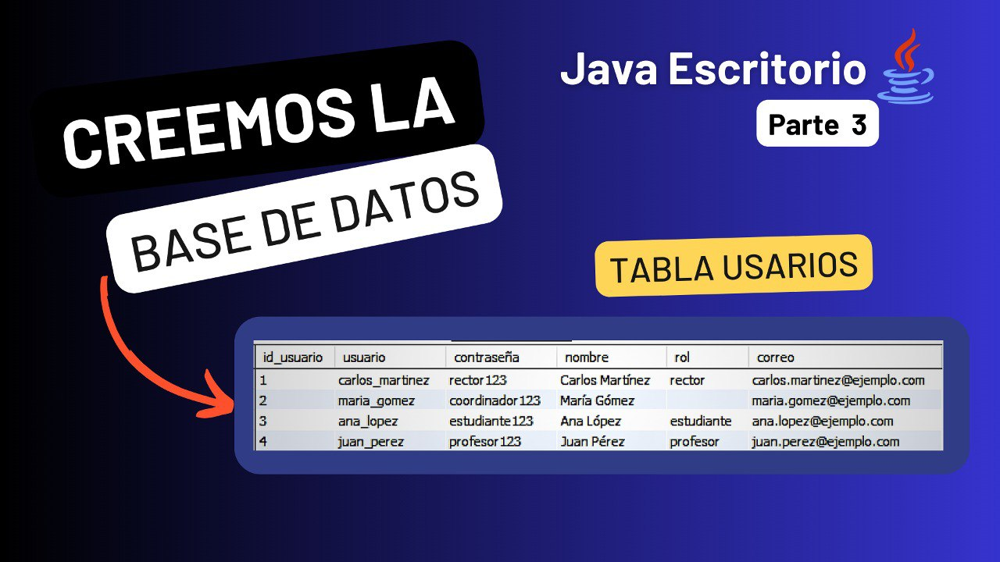

<!-- Banner -->

<h1 align="center">Hola 👋, soy Carlos Marrugo / @carlosdev ✨</h1>

  
  
  
  
  
  

 
<h2 align="left">Sobre mí 😃</h2>

🎓 SYSTEMS ENGINEER STUDENT (+2 Years)  
Passionate about technology and solving problems through code.

🎥 CONTENT CREATOR  
I share my knowledge 📚 on social media, teaching based on extensive study 😵 and hands-on programming experience.

📝 Roles in the field  
Developer, entrepreneur, freelance programmer with over 3 years of experience, and who knows what the future holds ☺️.

### Skills

<h2 align="left">Latest YouTube Videos 🎥</h2>
<table>
  <tr>
    <td align="center">
      
      
<b>App Escritorio(MVC,MySQL,Xampp)</b>

      
29K views • 2 weeks ago

    </td>
    <td align="center">
      
      
<b>Create Database MySQL Java</b>

      
17K views • 2 weeks ago

    </td>
    <td align="center">
      
      
<b>Everything You Need to Know About Git</b>

      
17K views • 3 weeks ago

    </td>
  </tr>
</table>
